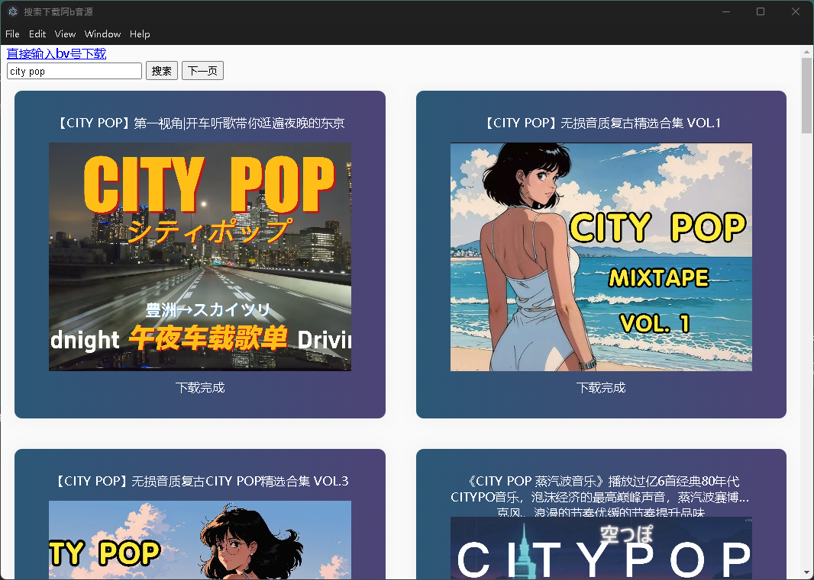

# 毛阿b音源


> 本质上通过对bv号发出请求获取视频的地址，然后下载dash格式下的音频流，并保持文件和视频的封面等信息，再通过ffmpeg转码，最后将封面信息整合进音频文件中或者再开发一个专用播放器

## 大致ui


## 测试资源
  - 视频
  ```
  // bv号为 BV1WX4y1L7je 
  https://upos-sz-mirror08c.bilivideo.com/upgcxcode/04/15/1225081504/1225081504-1-16.mp4?e=ig8euxZM2rNcNbRVhwdVhwdlhWdVhwdVhoNvNC8BqJIzNbfq9rVEuxTEnE8L5F6VnEsSTx0vkX8fqJeYTj_lta53NCM=&uipk=5&nbs=1&deadline=1706851556&gen=playurlv2&os=08cbv&oi=1947651412&trid=e10b79230f084a6eb20b0522aa3f4637h&mid=0&platform=html5&upsig=f55ed24fb571db9a300d7e8d2998ba49&uparams=e,uipk,nbs,deadline,gen,os,oi,trid,mid,platform&bvc=vod&nettype=0&f=h_0_0&bw=48958&logo=80000000
  ```
  - [**阿b接口对应接口**](https://github.com/SocialSisterYi/bilibili-API-collect/blob/master/docs/video/videostream_url.md)
    - https://github.com/SocialSisterYi/bilibili-API-collect/blob/master/docs/video/videostream_url.md 
    - 对应postman
      ```
      // 通过bv号获取cid
      https://api.bilibili.com/x/web-interface/view?bvid=BV1WX4y1L7je
      
      // 通过上面获得bv和cid去获取对应视频的dash格式数据
      https://api.bilibili.com/x/player/playurl?bvid=BV1WX4y1L7je&cid=1225081504&qn=80&platform=pc&high_quality=1 
      ```

## 流程
  - [x] 先通过bv号去获取对应的视频信息补全请求dash格式数据的参数
  - [x] 然后通过bv号+补全的参数去请求dash格式数据
  - [x] 下载dash格式下audio的相关数据保存成文件，并且保存视频封面
  - [ ] ~~利用ffmpeg进行转码成mp3和写入封面~~
    - 先不写入封面，因为会有下载顺序的问题
  - [x] 利用electron做gui显示 
  - [x] 支持搜索并下载
  - [ ] 支持合集搜索和下载
  - [ ] 播放器
  - [ ] ffmpeg的启动检测
